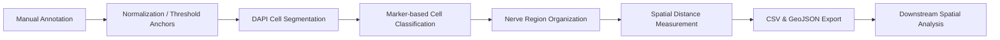

# 🧫 QuPath MxIF Analysis Toolkit

<div align="center">

<a href="#chinese">中文</a> | <a href="#english">English</a>

[]()
[]()
[]()
[]()
[]()

</div>

---

<a id="chinese"></a>

# 🧫 QuPath MxIF 分析工具包（中文）

<div align="center">

**半自动化 QuPath 工作流 · 多重免疫荧光全切片图像分析**

**🔬 面向肿瘤-神经-免疫微环境研究**

</div>

---

## 📌 工具包能做什么？

- 🧪 **DAPI 细胞核分割**
- 🏷️ **基于标记物的细胞分类** (CD3·CK)
- 📏 **参考区域归一化与阈值估计**
- 🧠 **神经区域组织** (分割或标注整理)
- 📐 **距离测量**
- 📤 **CSV 与 GeoJSON 导出**
- 🛠️ **层级修复工具**

---

## 🎯 设计用途

本项目专为多重免疫荧光全切片图像的计算病理学工作流设计，重点分析**神经周围浸润 (PNI)** 区域的**肿瘤-神经-免疫微环境**。  
工作流为半自动流程，需要手动绘制标注并进行视觉质控。

---

## 🧠 为什么需要这个工作流？

在 MxIF 全切片图像分析中：

- 固定阈值容易受到批次效应与自发荧光影响
- annotation 与 hierarchy 经常混乱
- 神经区域与免疫区域关系复杂
- 下游空间统计需要结构化导出

本工具包的目标是：

> 将病理人工标注与可复现的计算特征提取连接起来。

---

## ⚙️ 环境要求

| 项目 | 说明 |
|------|------|
| **QuPath** | v0.5.1 |
| **图像** | 已校准的 MxIF 全切片图像 |
| **脚本引擎** | 启用 Groovy 脚本 |

### 🧬 推荐图像通道

| 生物学靶标 | 默认通道名 |
|------------|----------------|
| 细胞核 | `DAPI` / `DAPI (C1)` |
| 免疫标记 | `Opal 620` |
| 肿瘤标记 | `Opal 780 (C6)` |
| 神经标记 | `Opal 480` |

---

## 🏷️ 标注规范

### 必需标注类

| 类名 | 含义 |
|------|------|
| `PNI-` | PNI 阴性区域 |
| `PNI+: Immune Responsive` | PNI 阳性伴免疫应答 |
| `PNI+: Immune Excluded` | PNI 阳性伴免疫排斥 |

### 可选辅助标注

| 名称 / 类 | 含义 |
|------------|------|
| `Normalization Patch` | 用于强度归一化或质控的区域 |
| `dark_ref` | 暗场 / 背景参考区域 |
| `bright_ref` | 亮场 / 阳性参考区域 |
| `nerve_regions` | 神经区域标注 |

---

## 🔄 工作流全景


> *建议始终对分割与分类结果进行可视化检查。*

---

## 🚀 Quick Start（推荐）

### Step 1 — 绘制 PNI Annotation

至少创建：

- `PNI-`
- `PNI+: Immune Responsive`
- `PNI+: Immune Excluded`

---

### Step 2 — 运行细胞分割

先运行：

`scripts/02_cell_segmentation/00_segment_cells_selected_annotations.groovy`

用于调试参数。

---

### Step 3 — 运行细胞分类

运行：

`scripts/03_cell_classification/01_classify_cd3_cells_selected_annotations.groovy`

---

### Step 4 — 导出结果

运行：

`scripts/06_export/02_export_project_cell_measurements_batch.groovy`

---

### Step 5 — 下游分析

在 Python / R 中进行空间统计分析。

---

## 🖼️ Example Results

### Cell segmentation


---

### Cell classification


---

### QuPath hierarchy organization


---

## 📁 仓库结构

```
QuPath-MxIF-Analysis-Toolkit/
├── README.md
├── LICENSE
├── .gitignore
├── docs/
│   ├── annotation_convention.md
│   ├── channel_convention.md
│   ├── output_schema.md
│   ├── troubleshooting.md
│   └── screenshots/
├── scripts/
│   ├── 00_setup/
│   ├── 01_normalization/
│   ├── 02_cell_segmentation/
│   ├── 03_cell_classification/
│   ├── 04_nerve_region/
│   ├── 05_spatial_measurement/
│   ├── 06_export/
│   ├── 99_debug_utils/
│   └── experimental/
```

---

## 🧩 脚本模块详解

### 00_setup – 准备

标注层级工具、统计框数、建立神经区域的父-子关系。

### 01_normalization – 归一化

利用参考区域估算显示锚点与自适应阈值。

### 02_cell_segmentation – 细胞分割

基于 DAPI 的细胞分割。  
👉 建议先在选中标注上运行以调试参数，再批量运行。

### 03_cell_classification – 细胞分类

按标记强度分类：

- `immune_cell`
- `tumor_cell`
- `unclassified` / `none`

### 04_nerve_region – 神经区域

神经区域分割与层级整理。  
⚠️ 神经分割脚本属于实验性模块，运行后需视觉检查。

### 05_spatial_measurement – 空间测量

计算细胞到神经区域标注的距离。

### 06_export – 数据导出

导出细胞级测量值与标注级几何信息。

| 输出文件 | 描述 |
|----------|------|
| `export_cells_by_annotation_*.csv` | 细胞级测量值，按父级 PNI 分组 |
| `geojson_<annotation_id>.geojson` | 每个标注关联的神经区域几何 |
| `all_shapes.json` | 全部导出的标注几何 |
| `all_cells.csv` | 全部导出的细胞测量值 |

### 99_debug_utils – 调试工具

用于调试与清理的脚本。  
⚠️ 可能删除、移动或重置对象，请谨慎使用。

---

## 🚦 推荐运行顺序

1. 绘制或加载目标 PNI 标注。
2. （可选）绘制 `Normalization Patch`，`dark_ref` 和 `bright_ref`。
3. 在选中标注上运行细胞分割，进行参数调试。
4. 对所有 PNI 标注批量运行细胞分割。
5. 运行基于标记物的细胞分类。
6. 整理或分割神经区域。
7. 计算距离到标注的测量值。
8. 导出 CSV 与 GeoJSON。
9. 在 Python、R 或其他工具中进行下游分析。

---

## 📚 Additional Documentation

| Document | Description |
|---|---|
| `docs/annotation_convention.md` | Annotation naming and hierarchy rules |
| `docs/channel_convention.md` | Recommended image channel naming |
| `docs/output_schema.md` | Export CSV / GeoJSON schema |
| `docs/troubleshooting.md` | Common workflow issues |

---

## ⚠️ 重要提示

- 🔍 始终对分割与分类结果进行可视化检查。
- 📊 阈值依赖于具体数据集，需按需调整。
- 📛 通道名称可能需要根据您的图像数据修改。
- 🧪 本工具包适用于 QuPath v0.5.1，其他版本未测试。
- 🧬 这是一个研究工作流，并非临床诊断流水线。

---

## 📜 License

MIT License.

---

## 📖 引用

如果您的研究受益于本工具包，请引用此仓库。

---

<a id="english"></a>
# 🧫 QuPath MxIF Analysis Toolkit（English）

<div align="center">

**A semi-automated QuPath workflow for multiplex immunofluorescence whole-slide image analysis**

**🔬 Designed for tumor-nerve-immune microenvironment research around perineural invasion**

</div>

---

## 📌 What this toolkit does

- 🧪 DAPI-based cell / nucleus segmentation
- 🏷️ Marker-based immune and tumor cell classification
- 📏 Reference-region-based normalization and threshold estimation
- 🧠 Nerve region segmentation or annotation organization
- 📐 Spatial distance-to-annotation measurement
- 📤 CSV & GeoJSON export
- 🛠️ QuPath hierarchy repair utilities

---

## 🎯 Intended use

This project is designed for computational pathology workflows involving multiplex immunofluorescence (MxIF) whole-slide images, with a focus on the tumor-nerve-immune microenvironment surrounding perineural invasion (PNI) regions.

The workflow is semi-automated and assumes:

- manual pathological annotations
- iterative parameter tuning
- visual quality control throughout the analysis

---

## 🧠 Why this workflow exists

MxIF whole-slide image analysis often suffers from:

- batch effects and autofluorescence contamination
- inconsistent annotation hierarchy organization
- complex tumor-immune-nerve spatial relationships
- limited support for downstream spatial feature extraction

Many pathology workflows focus only on segmentation or classification, but real computational pathology pipelines also require:

- annotation management
- hierarchy repair
- reproducible export formats
- spatial distance measurements
- downstream analysis compatibility

This toolkit aims to bridge:

> manual pathological annotation and reproducible computational feature extraction.

---

## ⚙️ Requirements

| Item | Description |
|------|------|
| **QuPath** | v0.5.1 |
| **Images** | Calibrated MxIF whole-slide images |
| **Script engine** | Groovy enabled |

### 🧬 Recommended image channels

| Biological target | Default channel |
|---|---|
| Nuclei | `DAPI` or `DAPI (C1)` |
| Immune marker | `Opal 620` |
| Tumor marker | `Opal 780 (C6)` |
| Nerve marker | `Opal 480` |

---

## 🏷️ Annotation convention

### Required annotation classes

| Class | Meaning |
|---|---|
| `PNI-` | PNI-negative region |
| `PNI+: Immune Responsive` | PNI-positive region with immune infiltration |
| `PNI+: Immune Excluded` | PNI-positive region with immune exclusion |

### Optional helper annotations

| Name / Class | Meaning |
|---|---|
| `Normalization Patch` | Region for intensity normalization or QC |
| `dark_ref` | Dark/background reference region |
| `bright_ref` | Bright/positive reference region |
| `nerve_regions` | Nerve region annotations |

---

## 🔄 Workflow overview



> *Visual inspection of segmentation and classification results is strongly recommended.*

---

## 🚀 Quick Start

### Step 1 — Draw PNI annotations

Create at least:

- `PNI-`
- `PNI+: Immune Responsive`
- `PNI+: Immune Excluded`

Optional helper annotations:

- `Normalization Patch`
- `dark_ref`
- `bright_ref`
- `nerve_regions`

---

### Step 2 — Run cell segmentation

First run:

`scripts/02_cell_segmentation/00_segment_cells_selected_annotations.groovy`

for parameter tuning and visual inspection.

After confirming segmentation quality, run the batch workflow on all target annotations.

---

### Step 3 — Run cell classification

Run:

`scripts/03_cell_classification/01_classify_cd3_cells_selected_annotations.groovy`

to classify immune-positive cells.

---

### Step 4 — Organize nerve regions

Use the nerve-region organization scripts to:

- move nerve annotations into hierarchy
- repair parent-child relationships
- prepare downstream spatial analysis

Experimental segmentation scripts are provided under:

`/scripts/experimental/`

---

### Step 5 — Export results

Run:

`scripts/06_export/02_export_project_cell_measurements_batch.groovy`

to export combined project-level measurements.

---

### Step 6 — Downstream analysis

Perform downstream analysis in:

- Python
- R
- GeoPandas
- spatial statistics workflows
- machine learning pipelines

---

## 🖼️ Example Results

### Cell segmentation


---

### Cell classification


---

### QuPath hierarchy organization


---

## 📁 Repository structure

```
QuPath-MxIF-Analysis-Toolkit/
├── README.md
├── LICENSE
├── .gitignore
├── docs/
│   ├── annotation_convention.md
│   ├── channel_convention.md
│   ├── output_schema.md
│   ├── troubleshooting.md
│   └── screenshots/
├── scripts/
│   ├── 00_setup/
│   ├── 01_normalization/
│   ├── 02_cell_segmentation/
│   ├── 03_cell_classification/
│   ├── 04_nerve_region/
│   ├── 05_spatial_measurement/
│   ├── 06_export/
│   ├── 99_debug_utils/
│   └── experimental/
```

---

## 🧩 Script modules

### 00_setup – Preparation

Utilities for:

- annotation hierarchy organization
- counting-box preparation
- parent-child relationship repair
- nerve-region hierarchy management

---

### 01_normalization – Normalization

Reference-region-based normalization and threshold estimation.

This module estimates:

- display anchors
- percentile-based intensity ranges
- adaptive threshold references

for more stable MxIF analysis.

---

### 02_cell_segmentation – Cell segmentation

DAPI-based nucleus/cell segmentation.

👉 Recommended workflow:

1. run on selected annotations first
2. visually inspect segmentation quality
3. then run batch analysis

---

### 03_cell_classification – Cell classification

Marker-intensity-based classification.

Current supported classes include:

- `immune_cell`
- `tumor_cell`
- `unclassified`
- `none`

---

### 04_nerve_region – Nerve regions

Nerve-region segmentation and hierarchy organization.

⚠️ Experimental segmentation modules are included and should always be visually verified before downstream analysis.

---

### 05_spatial_measurement – Spatial measurement

Distance-to-annotation measurements for downstream spatial analysis.

Typical downstream applications:

- immune infiltration analysis
- tumor-nerve distance analysis
- graph-based spatial modeling
- PNI feature engineering

---

### 06_export – Export

Export cell-level measurements and annotation geometries.

| Output file | Description |
|---|---|
| `export_cells_by_annotation_*.csv` | Cell measurements grouped by parent PNI annotation |
| `geojson_<annotation_id>.geojson` | Nerve geometries associated with each annotation |
| `all_shapes.json` | Exported annotation geometries |
| `all_cells.csv` | Exported cell measurements |
| `combined_cell_measurements.csv` | Combined project-level measurements |

---

### 99_debug_utils – Debug utilities

Scripts for cleanup, hierarchy repair, and debugging.

⚠️ Some utilities may:

- delete objects
- move hierarchy relationships
- reset classifications

Use carefully.

---

## 🚦 Recommended workflow order

1. Draw or import PNI annotations.
2. (Optional) Draw normalization and reference annotations.
3. Run segmentation on selected annotations for tuning.
4. Run batch segmentation on all target PNI annotations.
5. Perform marker-based cell classification.
6. Organize or segment nerve regions.
7. Compute spatial distance measurements.
8. Export CSV and GeoJSON outputs.
9. Perform downstream spatial analysis.

---

## 📚 Additional Documentation

| Document | Description |
|---|---|
| `docs/annotation_convention.md` | Annotation naming and hierarchy rules |
| `docs/channel_convention.md` | Recommended image channel naming |
| `docs/output_schema.md` | Export CSV / GeoJSON schema |
| `docs/troubleshooting.md` | Common workflow issues |

---

## ⚠️ Important notes

- Always visually inspect segmentation and classification results.
- Thresholds are dataset-dependent and require tuning.
- Channel names may need adjustment for different datasets.
- Experimental modules are not guaranteed to be robust.
- Tested primarily on QuPath v0.5.1.
- This is a research workflow, not a clinical diagnostic pipeline.

---

## 📜 License

MIT License.

---

## 📖 Citation

If this toolkit contributes to your research, please cite this repository.